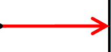
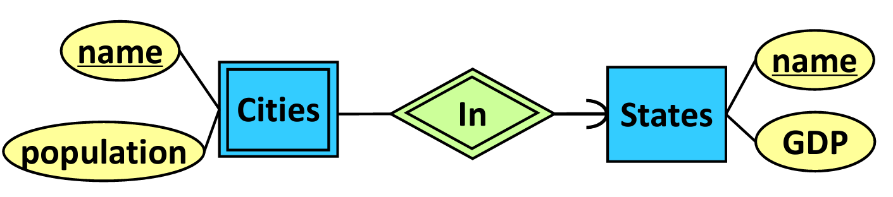

# SC2207: Intro to Databases

## Mid-term Quiz Sample Questions

**1. A relation schema $\mathcal{R}(A,B,C,D,E)$ has $\mathcal{F} = \{A \to C,\ B \to D,\ AB \to E\}$. Which normal form is this in?**

1NF. The only candidate key is $\{A, B\}$, but there are partial dependencies on $A$ and $B$.

**2. A many-to-one relationship exists between two entity sets, $\mathcal{R}$ and $\mathcal{S}$**. Which of the following statement(s) is/are true?

1. 🟢 **Key of R $\to$ Key of S**
2. Key of S $\to$ Key of R
3. 🟢 **Key of R $\to$ attributes of S**
4. Key of S $\to$ attributes of R

Assuming we have many R to one S. Then, (3) is true, as the key of R is equal to the key of S, and the key of S is a key, which mean it determines all attributes of S. Since (3) is true, (1) is trivially true, since the key of S is an attribute of S.

While the key of S "determines" the key of R in the sense that if one of S's keys is updated, then all entries in R with the same key must be updated, it does not determine the key of R in the sense of functional dependencies.

**3. Given a set of FDs $\{A \to C,\ AC \to D,\ AD \to B\}$**, which of the following is/are minimal basis?

1. $A \to C,\ A \to D,\ AD \to B$ --- $AD \to B$ is not minimal.
2. 🟢 **$A \to B,\ A \to D,\ A \to C$**
3. $A \to C,\ C \to D,\ AD \to B$ --- this is not minimal, $A \to C \to D \implies A \to D$, which makes $AD \to B$ reducible to $A \to B$.
4. $A \to C,\ A \to D,\ D \to B$ --- $D \to B$ is not true

Minimizing one possible basis by removing two redundant determinants, we get: $A \to C, A \to D, A \to B$.

**4. Which of the following is true of a relation schema $\mathcal{R}(A, B, C)$, where $B$ is a key attribute of another entity set and $C$ is not a key attribute of any entity set?**

1. In the ER diagram, $\mathcal{R}$ must be an entity set --- Not necessarily, it could be a M2M relationship where $A$ is a key of another entity set.
2. In the ER diagram, $\mathcal{R}$ must be involved in a relationship with another entity set whose key is $C$ --- obviously not this one, since $C$ is not a key attribute of anything.
3. 🟢 **In the ER diagram, $\mathcal{R}$ must be involved in a relationship with another entity set whose key is $B$**
4. In the ER diagram, $\mathcal{R}$ must be involved in a relationship with another entity set whose key is $A$ --- Not necessarily, $A$ can be part of the PK of $\mathcal{R}$ in a many-to-one.

## Questions to Revise

* [x] Denotes official correct answer

🔴 Denotes answers that I may get/have got wrong due to conceptual flaws.

#### What does a rectangle in an ER diagram represent?

* [ ] **A. 🔴 An entity.**
* [ ] B. A person or object in the real world.
* [x] **C. 🔴 A set of entities.**
* [ ] D. Data about an entity.

[ER Diagram Checkpoint 1]

**Flaw:**

* A. refers to [one single row/record/tuple](#entity--record--tuple--row) in an [entity set](#entity-set)

#### You can use a referential integraity constraint in a M2M relationship

* [ ] **🔴 True**
* [x] **False**

[ER Diagram Checkpoint 2]

**Flaw:**

* The [referential integrity constraint](#erd-relationships-referential-integrity-constraints) **only include the sharp and rounded arrows**. [Degree constraints](#degree-constraints) (like $\ge 1$) are not considered referential integrity constraints.

#### Given a table $\mathcal{T}$, if $\mathcal{T}$ is in BCNF, $\mathcal{T}$ has the following good properties

* [x] A. T has no update or delete anomalies
* [x] B. T has very small redundancy
* [x] **C. 🔴 T can be reconstructed from the decomposed tables**
* [ ] D. T only has non-trivial FDs

[BCNF Checkpoint 2]

**Flaw:**

* C. While BCNF decomposition does not preserve FDs, it **does not affect** the reconstructability of tables. All BCNF (and 3NF) decompositions always has [lossless join](#lossless-join-property).

#### Given table $\mathcal{T}$, where $X, Y$ are sets of attributes from $\mathcal{T}$ where $Y$ has more attributes than $X$, if $X^+ = Y$ such that $Y$ does not contain all the attributes of $\mathcal{T}$, we can conclude that:

* [x] **A. 🔴 $\mathcal{T}$ is not in BCNF**
* [x] B. $X$ is not a key in $\mathcal{T}$
* [x] C. $X \to Y$ is a non-trivial FD in $\mathcal{T}$
* [ ] D. $Y$ is part of a key in $\mathcal{T}$

[BCNF Learning Checkpoint 2]

**Flaw:**

* A. is inferrable because if $Y = X^+$, is not the entire set of attributes, then any superkey that includes attributes in $X$ must also include attributes in $\mathcal{T}$ that are not contained within $Y$. This means that $X$ is not a superkey, and $X \to Y$ is a partial dependency, which violates 2NF, which violates BCNF.

## "English Exam" questions

In learning checkpoints, these are the questions that don't make sense/have ambiguous interpretations/bad grammar.

The prof is always correct, so memorize these.

* [x] denotes the official correct answer

🟢 denotes that this particular choice of answer is (mostly) sensible

❓❗ denotes that the answer is the opposite of what is expected, due to bad or misleading phrasing.

#### A key in an entity set may only have one attribute

* [x] True ❓❗
* [ ] False ❓❗

[ER Diagram Checkpoint 2]

Reason: This question uses the term **_may_** in the sense that it **could have**, but not necessarily have. **May only have** can also be interpreted as a polite way of saying "should/must only have". The correct answer is **True** because it could have one attribute.

Correct phrasing of question: **A key in an entity set can only have one attribute**

#### When mapping ER diagram to relational schema, a M2M relationship becomes:

* [x] A. Relation
* [x] **B. 🔴 Relational Schema**
* [x] C. Table
* [x] **D. 🔴 All of the above**

[ER Diagram Checkpoint 3]

Reason: The canonically accepted definition of a [relational schema](#relational-schema) is the set, attribute types, and metadata of all relations in a database that pertain to logical implementation. However, in this question, the answer selection "B. relational schema" has the intended meaning of _"a part of the relational schema"_, rather than the _entirety_ of the relational schema. This question has the philosophical and linguistical paradox/ambiguity of the [Ship of Theseus](https://en.wikipedia.org/wiki/Ship_of_Theseus).

Corrected intended phrasing of option B:

* [x] B. **Part of the** relational schema

#### We use subclasses in ER diagrams when

* [x] **A. 🔴 A subclass has attribute(s) that is/are absent from the superclass**
* [x] B. A subclass has its own relationship with some other entity sets
* [ ] C. We need a stronger supporting entity set
* [ ] D. All of the above

[ER Diagram Checkpoint 3]

Reason: "A subclass has attributes that are absent from the superclass" is a statement of fact, and is one possible reason for using a subclass amongst two. However, this question uses the quantifier word **_when_**, which makes it seem that this question is asking for a **sufficient** condition, rather than a **necessary** condition, incorrectly implying that the reader picks the more sufficient condition.

In English, the sentence structure "X when Y" is equivalent to "When Y, then X", which is equivalent to "If Y, then X", meaning $X \implies Y$ in first order logic. Instead, this question intended to ask the converse: $X \impliedby Y$, i.e., "X _because_ Y", which will ask for the reader to list down **all** reasons (conjugated with boolean AND) that necessitates the use of subclasses.

Corrected intended phrasing of question: **We use subclasses in ER diagrams _because_...**

#### If a relational schema is not properly formulated, the following anomalies *may* occur

* [x] A. Certain attributes may have duplicate values in the table ❓❗
* [ ] B. Certain attributes may be duplicated in the table 🟢
* [ ] C. Certain rows in the table may be duplicates 🟢
* [ ] D. Certain rows and columns in the table may be duplicates ❓❗

[Functional Dependency Checkpoint 1]

Reason:

* A. It is not fundamentally wrong to have duplicate values in a table, as long as the duplicate values are not the entire candidate key. Yet, one *possible* reason for anomalies **_may, could, perchance, perhaps_** be due to duplicate values that should have been unique.
* B. Consistent with the [previous question](#why-do-anomalies-occur-in-tables), if this happens it breaks 1NF, so it cannot be called a table.
* C. Same reason as B.
* D. What does rows and columns being duplicates even mean???

#### "Why" do anomalies occur in tables?

* [x] A. There is a bad combination of attributes. 🟢
* [ ] B. Certain attributes may appear more than once. ❓❗
* [x] C. There is one or more relationships among attributes. ❓❗
* [x] D. There are functional dependencies among attributes. ❓❗

[Functional Dependency Checkpoint 1]

Reason:

This question *intends* to ask: **"What are possible reasons for anomalies in tables?"**, i.e., they are asking for **necessary** conditions, and not **sufficient** conditions, unlike implied by the phrasing of this question.

* A. is both a necessary and sufficient condition for anomalies --- no ambiguity.
* B. Having attributes appearing more than once will definitely cause anomalies, but it breaks the principles of 1NF, meaning that if this rule was broken, it cannot even be considered a relation/table, thus it is not a reason why anomalies occur **in tables**.
* C. Having one or more relationships among attributes is not a *sufficient* condition for anomalies, but it is a *necessary* condition, and thus is a possible reason for anomalies. If two attributes are unrelated, then they do not have to be consistent with each other, and there are no FDs between them, so anomalies cannot occur.
* D. FDs are equivalent to relationships, e.g. $A \to B$ can be taken to mean Many $A$ is to One $B$, so this is true for the same reason C. is true.


#### T/F: A key is a set of attributes in a table that decides <u>_some_</u> other attributes

Answer: False ❓❗

[Functional Dependency Checkpoint 2]

Reason: A [key](#formal-keys) is a set of attributes in a table that decides **_all_** other attributes

#### T/F: A table R is in BCNF if and only if the LHS of every FD is a superkey

Answer: False ❓❗

[BCNF Checkpoint 1]

Reason: A table R is in [BCNF](#boyce-codd-normal-form-bcnf35nf-no-transitive-dependencies-at-all) if and only if the [LHS](#determinant-set) of every [**_non-trivial_**](#trivial-superkey) FD is a superkey, and

#### T/F: In 1NF, some attributes have atomic values.

Answer: False ❓❗

[3NF Checkpoint 1]

Reason: In 1NF, **_all_** attributes have atomic values.

#### T/F: In a table that satisfies 3NF, key-attributes are determined only by candidate keys

Answer: False ❓❗

[3NF Checkpoint 1]

Reason: The condition for 3NF is that **the table must be in 2NF, _AND_**, key-attributes are determined only by candidate keys.

#### T/F: In a minimal basis, we only require the right-hand side of some FDs to have only one attribute.

Answer: True ❓❗

Reason: In the phrase "we _only_ require the RHS of some...", this quantifier implies that this is the sole necessary condition for a minimal basis, which is not true.

However, the word "only" prefixing a relative clause in English does not have solvable nor definite context.

Grammatically speaking, these are all valid interpretations of this sentence:

1. In a minimal basis, we require **only**(the RHS) of some FDs to have only(one attribute)
   * Means: For a minimal basis, only the RHS, as opposed to both the LHS and RHS, is required to have only one attribute.

2. In a minimal basis, we require **only**(the RHS of some FDs) to have only(one attribute)
   * Means: For a minimal basis, only the RHS of some FDs, as opposed to the RHS of all FDs, is required to have only one attribute.

3. In a minimal basis, we **only**(require the RHS of some FDs to have only(one attribute))
   * Means: The RHS of some FDs having one and only one attribute is a necessary condition for a minimal basis, as opposed to other conditions also being necessary.

4. In a minimal basis **only** we(require the RHS of some FDs to have only(one attribute))
   * Means: For a minimal basis, only we, as opposed to Alice, Bob, Tom, Dick, or Harry, require the RHS of some FDs to have only one attribute.

This question's intended meaning is (3.) which is better phrased as:

* [ ] For a minimal basis, the only requirement is that the right-hand side of some FDs has only one attribute.

The use of the relative clause marker "is that" or "that" in English is an important feature in grammatical syntax. [Dependent clause markers](https://alic.sites.unlv.edu/chapter-01-14-dependent-clause-markers/) (i.e., delimiters) in formal language theory and linguistics provide necessary information which tells the listener how to parse the depth and position of relative clauses and quantifiers in the Abstract Syntax Tree.

## 0. Preliminary Definitions

#### Database

A database is data organized to optimize retrieval and storage by a computer. Not to be confused with a [DBMS](#database-management-system), which is a particular software _implementation_ of a database.

#### Database Management System

A DBMS is a software that interacts with the user, applications, and the database itself to capture and analyze data. A general-purpose DBMS is designed to allow the definition, creation, querying, update, and administration of databases.

#### Entity / Record / Tuple / Row

One single entry representing one logical object inside an [Entity Set](#entity-set). Do not confuse with entity **sets**.

#### Entity Set

A collection of entities of the same type.

#### Attribute / Field / Column

A property of an entity set.

#### Relation / Table / SQL Table

Represents a single logical table in a database. The collection of all relations is called the [Relational Schema](#relational-schema).

A relation/table can come from [Entity Sets](#entity-set), [Relationships](#erd-relationships-referential-integrity-constraints), or as the result of normalizing a table that is not in desirable [normal form](#3--4-normal-forms).

## 1. Entity Relationship Diagrams

### ERD Keys


* Every Entity Set/Table/Rectangle must have at least one key which uniquely identifies a record
* Keys are denoted by an underline
* Compound keys/multiple underlines mean the unique combination of the keys is the identifier.

### ERD Relationships: Referential Integrity Constraints


* "Capital of" is the name of the relationship. Relationships are diamonds/parallelograms.
* Rounded arrow on the Entity Set means there must be **one and only one** of it in the relation. 
* Sharp arrow on the Entity Set means there is **at most one** of it in the relation. 
* This means A Country must have one and only one capital City, and a City can be the capital of at most one Country, or not at all.

#### Degree Constraints


* &ge;1 means each company must hire **at least one** person
* Rounded arrow means each person must be hired by **one and only one** company.
* Other degree constraints can be used.

!!! warning The &ge;1 sign/degree constraint is on the *OPPOSITE SIDE* of which Entity Set it applies to!
    E.g., &ge;1 on the `Companies` side means that there are &ge;1 `Persons` hired in a company.

### ERD Subclass:


* The 'isa' triangle points towards the superclass.
* Each subclass needs its own 'isa' triangle.

### Weak Entity Sets



* A weak entity set (double rectangle) cannot be uniquely identified by its own attributes. E.g., there are multiple `Cities` called "Singapore" in the world
* They must be attached to a strong entity set via a **supporting relationship** (double diamond)
* In implementation, the compound key of the strong and weak entity sets combined will be the unique identifier of the weak entity set.

## Relational Schema

We convert [Entity Sets](#entity-set) and [Relationships](#erd-relationships-referential-integrity-constraints) in an ERD into [Relations](#relation--table--sql-table) (aka Tables) in a database.

The set of relations/logical tables in a database is called the **Relational Schema**, aka Schema.

Trivially, each Entity Set becomes a Relation.

However, in M2M relationships, the relationship itself has an intermediate table, contributing an extra relation.

Additional relations/tables may be created in the [normalization process](#3--4-normal-forms).

### Converting Many-to-Many Relationships into Relations

If A-M2M-B,

* We create 3 tables, A, B, and R, for the relationship. This way, 1A : Many R, and 1B : Many R.
* R will have foreign keys to A and B and the compound of these two keys is the primary key of R.

### Converting subclass relationships into Relations

There are 3 ways to do this in the slides (why???), but the **ER model is preferred**.

#### Standard Entity Relation (ER) Model

* We create a Relation/Table for each subclass, containing only attributes unique to the subclass, and a foreign key referencing the superclass ID.
* We create a Relation for the superclass, containing all attributes that are general over all subclasses.

#### Object-Oriented (OO) Model

* Create one table per combination of superclass and subclasses. E.g. if B, C are subclasses of A, then we have to create:
  * A
  * B
  * C
  * B-C
* Entities are mutually exclusive between the above tables and only appears once.
* E.g., if an entity is in B, it "is a" B, and also "is a" A
* If an entity is in A, then it is only an A

#### Single Table/NULL Approach

* Put all attributes of all subclasses into one Relation, and have NULLs for N/A attributes.

### Converting Weak Entity Sets into Relations

* A weak entity set will have (an) additional attribute(s) referencing the primary key of the strong supporting entity.

## 2. Functional Dependencies

### Data Anomalies

Consider the table with the compound primary key `(NRIC, PhoneNumber)`


The above example table is "bad" as there are [functional dependencies](#functional-dependencies-formal-definition) that are not captured in the primary key. This causes the following data anomalies:

#### Redundancy

"Jurong East" duplicated across multiple records within a table

#### Update Anomaly

We can change Alice's address in the 1st record but not the 2nd, leading to inconsistencies.

#### Insertion Anomaly

We want to insert a new person without a phone number, but cannot because the phone number is part of the primary key. Inserting the same person with a different phone number at a different address is also allowed, which may not be desirable depending on the specs.

#### Deletion Anomaly

If Bob stops using a phone, we cannot remove Bob's phone number, because it is in the primary key of the table.

A deletion anomaly can also refer to the event where information gets lost forever when the last record with that information is deleted, which happens when a table has attributes that should have been in a separate table. E.g., consider a table with information about bank branches stored only within a table that also stores bank account records. If the last account for a branch is closed, then the branch information like address and phone number is lost forever.

### Functional Dependencies: Formal Definition

A functional dependency is written as:

$$ A_1, \dots, A_n \to B_1, \dots, B_n \in \mathcal{F}_\mathcal{R} $$

and is read as:

* *"$A_i$ functionally **determines** $B_i$"*
* *"The values of $A_i$ **determine** the values of $B_i$"*
* *"$B_i$ **depends** on $A_i$"*

For the purposes of this document, $\mathcal{F}_\mathcal{R}$ refers to the set of all functional dependencies in the relation $\mathcal{R}$.

Meaning:

* The values of $A_1, A_2, \dots$ can determine the values of $B_1, B_2, \dots$
* Equivalently, there do not exist two records with the same $A_i$, but different $B_i$
* Equivalently, $B_i$ is a (surjective) function of $A_i$, i.e., $\exists \varphi : A_1 \times \dots \times A_n \to B_1 \times \dots B_n$ such that $\forall a \in A, b \in B,\ b \equiv \varphi(a)$, but is not injective since different $A_i$ can map to the same $B_i$.
* This property can also be **vacuously true** (i.e., the table is empty, then all functional dependencies will hold by default)

Formally, the functional dependency relation $\to$ is a binary relation whose two arguments are sets of attributes. The sets are not ordered, and the operator is not commutative, so:

$$ AB \to CD \iff BA \to DC $$

#### Determinant set

The **determinant set** is the attributes on the left-hand side of $\to$, that determines the attributes on the right-hand side.

#### Dependent set

The **dependent set** is the attributes on the right-hand side of $\to$, that depend on the attributes on the left-hand side.

### Armstrong's Axioms

#### Axiom of Reflexivity (aka Trivial Functional Dependencies)

A set of attributes determines (a subset of) itself.
$$
    A \to A \\[0.5em]
    ABCD \to AC \\[0.5em]
    S \to T, \quad T \subseteq S
$$

Any functional dependency that is reflexive is called a **trivial functional dependency**.

#### Axiom of Augmentation

$$ A \to B \implies AC \to BC $$

#### Axiom of Transitivity

$$ [A \to B] \land [B \to C] \implies A \to C $$

### Intuitive Diagram for Proving Functional Dependencies


### Minimal basis of functional dependencies

Given any set of functional dependencies $\mathcal{F}$, we can find a minimal basis $\overline{\mathcal{F}} = \mathcal{B}$ that is equivalent to $\mathcal{F}$. We draw analogy to $\mathcal{F}$ as a spanning set of a vector space, and $\mathcal{B}$ as basis vectors of the vector space, which is a minimal spanning set.

Three conditions that determine whether $\mathcal{F} = \overline{\mathcal{F}}$ is minimal:

1. $\forall f \in \mathcal{F}$, the [dependent set](#dependent-set) (RHS) has only one attribute.
2. $\forall f \in \mathcal{F}$, the [determinant set](#determinant-set) (LHS) is minimal. I.e., no attribute can be removed from the determinant set without changing the meaning of the functional dependency.
3. $\forall f \in \mathcal{F}$, no $f \in \mathcal{F}$ should be derivable via [Armstrong's Axioms](#armstrongs-axioms) from $\mathcal{F} \setminus \{f\}$

**Example**: given a set of FDs:
$$
\mathcal{F} = \begin{Bmatrix}
    A \to BD \\
    AB \to C \\
    C \to D \\
    BC \to D
\end{Bmatrix}
$$
First, we split multi-attribute dependent sets into single-attribute dependent sets:
$$
\longrightarrow \begin{Bmatrix}
    A \to B \\
    A \to D \\
    AB \to C \\
    C \to D \\
    BC \to D
\end{Bmatrix}
$$
Already, we see that the determinant of $AB \to C$ does not have a minimal [determinant](#determinant-set). Since $A \to B$, we can remove $B$ from the determinant since it is already determined by $A$.
$$
\longrightarrow \begin{Bmatrix}
    A \to B \\
    A \to D \\
    A \to C \\
    C \to D \\
    BC \to D
\end{Bmatrix}
$$

!!! warning
    In $AB \to C$, we have deemed $B$ as unnecessary. Note that we cannot remove $A$ from the determinant! Though it seems like it, $A \to B \to C$ is **not true**. The mapping $\varphi : A \to B$ can be non-injective (the same $b \in B$ can be mapped to different $a \in A$), thus $B$ alone cannot uniquely determine $C$ despite $AB$ functionally determining $C$. Notice that the closure $\{B\}^+ = \{B\}$ is trivial, meaning that, on its own, it cannot determine any other values other than itself.

    $$
    A \times B \to C \land A \to B \quad\xcancel{\implies}\quad A \to C
    $$

!!! tip
    This step may look like hand waving. More formally, we look at the closures of the [determinant](#determinant-set) sets. Notice that $\{A, B\}^+ = \{A, B, C, D\} \implies AB \to C$, but if we remove $B$ from the determinant, notice that $\{A\}^+ = \{A, B, C, D\}$ anyways, since $A \to B$ and $B \to C$ is defined, hence, in $\mathcal{F}$, $A \to C \equiv AB \to C$

Now we see that $A \to D$ and $B \to D$ are redundant, since by transitivity, $A \to B, A \to C, C \to D$ already implies those FDs:
$$
\longrightarrow \begin{Bmatrix}
    A \to B \\
    A \to C \\
    C \to D \\
    BC \to D
\end{Bmatrix}
$$

Finally, notice that $BC \to D$ is redundant, since we already have $C \to D$, the closure of $\{B, C\}^+ = \{B, C, D\}$. This gives the minimal basis:

$$
\longrightarrow \overline{\mathcal{F}} = \begin{Bmatrix}
    A \to B \\
    A \to C \\
    C \to D
\end{Bmatrix}
$$
All three conditions for a minimal basis are satisfied.

We can manually verify that this is a minimal basis by checking the closures of every attribute in the relation are equal no matter whether we use $\mathcal{F}$ or $\overline{\mathcal{F}}$:

* $A^+ = \{A, B, C, D\}$
* $B^+ = \{B, C, D\}$
* $C^+ = \{C, D\}$
* $D^+ = \{D\}$

Notice that a minimal basis is not unique.

### Closure of a Set of Attributes

Let $S = \{ A, D \}$ be a set of attributes, and let the functional dependencies be:

$$
\mathcal{F} = \begin{Bmatrix}
    A \to B \\
    B \to C \\
    D \to E
\end{Bmatrix}
$$

The closure of $S$ is denoted as $S^+$, i.e., $\{A, D\}^+$, and is the set of all attributes that can be determined by $S$. Using $\mathcal{F}$, we have:

* $A \to B \implies B \in S^+$
* $B \in S^+ \land B \to C \implies C \in S^+$
* $D \to E \implies E \in S^+$
* $\therefore S^+ = \{A, B, C, D, E\}$

### Formal Keys

Here are formal definition of special classes of keys in database theory (not to be confused with keys in SQL)

Let $S$ be the set of all attributes in relation $\mathcal{R}$. Let $K \subseteq S$ be an improper subset of the attributes.

#### Superkey

If $K^+ = S$, then $K$ is a **superkey** of $\mathcal{R}$.

Then, $K \to S \setminus K$, i.e., $K$ can determine all other attributes in the relation.

##### Trivial Superkey

If some superkey is equal to the entire set of attributes in a relation, then it is called a **trivial superkey**. All tables in 1NF must have a trivial superkey to avoid repetition of records.

#### Candidate key (aka just "Key")

Let $K$ be a [superkey](#superkey) such that:
$$
\forall T \subsetneq K, \quad T^+ \ne S \iff T \text{ is not a superkey}
$$

Then this is a **candidate key** of $\mathcal{R}$, also known as a *minimal superkey*, or just a possible *key* of the table.

There can be more than one candidate key, and they can be of varying sizes.

#### Key-Attribute (Primary Attribute of a Candidate Key)

!!! info Note on nomenclature
    The term **Key-Attribute** is used in the lecture notes, but the more canonical term found online and in use worldwide is **Prime/Primary Attribute**. For the purposes of this document, we will use the term **Prime/Primary Attribute**.

!!! warning Misleading slide
    In the slides, it states that _a key-attribute is part of a multi-attribute key_. While this is correct, it can be misinterpreted as a key-attribute **not being the entire key** in a unitary/simple key. This is not true, as a key-attribute/prime-attribute is any attribute that belongs to any candidate key, whether simple/unitary or compound.

A **primary attribute** is any attribute that is contained in one or more [candidate key](#candidate-key-aka-just-key).

As a corollary, any **primary attribute** will be in the [determinant set](#determinant-set) of at least one [functional dependency](#functional-dependencies-formal-definition) in $\mathcal{F}$, if and only if $\mathcal{F}$ is non-empty (equivalently, the [trivial superkey](#trivial-superkey) is NOT a [candidate key](#candidate-key-aka-just-key)). This is true as a candidate key is a minimal superkey, and a superkey should be able to determine all other attributes. If primary attribute $P \in K_1$, then it must be in the left-hand side of some $[X \to Y] \in \mathcal{F}$

However, the converse is not true: a non-prime attribute may be in the determinant set of some functional dependency. Consider
$$
\mathcal{F} = \{A \to B \to C\}
$$
which are the FDs of a table in 2NF. Here, $A$ is the only candidate key, and $B$ is a non-prime attribute, but it is the [determinant](#determinant-set) of $C$.

!!! warning Not the same meaning as SQL's *primary key*
    This is not to be confused with the notion of a **primary key** in SQL, which is a candidate key that is (arbitrarily) chosen to be the "main" key, amongst other valid candidate keys.

## 2.5. Additional Formalisms

Just a list of terms on the internet.

#### Attribute Domain

The set of all possible values for an attribute. More informally, the **type** of the attribute (string, char, int, datetime, etc.)

#### What is the point of formalisms?

Functional dependencies are used as the axiomatic _a priori_ basis for constructing tables and deciding keys of a table.

Having only one assumable/external aspect provides a rigorous and consistent method, at the expense the need for much formal logic and deductive reasoning.

## 3--4. Normal Forms

### Intuitive definitions

* [1NF](#first-normal-form-1nf-specification-of-a-relation): Basic rules of a table/relation

* [2NF](#second-normal-form-2nf-no-partial-dependency): **No partial dependencies** --- All non-[prime attributes](#key-attribute-primary-attribute-of-a-candidate-key) (attributes not in any candidate key) should not be dependent on an incomplete part of a [candidate key](#candidate-key-aka-just-key). However, non-prime attributes depending on other non-prime attributes is allowed.

* [3NF](#third-normal-form-3nf-no-transitive-dependency-in-non-prime-attributes): **No transitivity** --- All **non-[prime attributes](#key-attribute-primary-attribute-of-a-candidate-key)** should depend on every [candidate key](#candidate-key-aka-just-key), and no partial dependencies.

* [BCNF (3.5NF)](#boyce-codd-normal-form-bcnf35nf-no-transitive-dependencies-at-all): **No partial-key transitivity** --- **Every attribute**, prime or non-prime, should depend on the entirety of **every candidate key**.

### First Normal Form (1NF): Specification of a Relation

* No [attribute domain](#attribute-domain) has relations as elements. I.e., **no table column can have a table as values**.
* An [attribute domain](#attribute-domain) does not change depending on the record (e.g., one column should always have the same type)
* There are no repeated attributes
* Invariant under sorting (both rows/records and columns/attributes are unordered tuples)
* Between each record, any candidate key is a minimal superkey, can uniquely determine a record, and is not null. Other attributes need not be unique.

### Second Normal Form (2NF): No partial dependency

Includes all rules in [1NF](#first-normal-form-1nf-specification-of-a-relation), and:

* Non-[prime attributes](#key-attribute-primary-attribute-of-a-candidate-key) should not be a **partial dependency** --- i.e., depends on *part* of a [candidate key](#candidate-key-aka-just-key), but not *all* of it.
* Equivalently, for every possible choice of primary key $\forall P_i \in \text{candidate keys}$, every attribute not in any $P$, i.e., $a \notin \bigcup P_i$ should be functionally dependent on the entire primary key.

This definition is motivated by the prevention of obvious sub-relations inside a relation. If $K = \{A,B\}$ and $B \to C \in \mathcal{F}$, then there should just be a separate relation/table for $B \to C$, since $C$ is not affected by $A$.

#### Example of violating 2NF

Consider a table `StudentCourses(student_id, course_no, course_fee)`:

| student_id | course_no | course_fee |
|------------|-----------|------------|
| 1          | CS101     | 1000       |
| 1          | CS201     | 1500       |
| 2          | CS101     | 1000       |
| 3          | CS301     | 2000       |

Assume that the course fee determined by the course taken, and that one student can take multiple courses.

We have the set of functional dependencies:
$$
\mathcal{F} = \begin{Bmatrix}
    \texttt{course\_no} \to \texttt{course\_fee}
\end{Bmatrix}
$$
However, notice that `course_no` on its own is not sufficient to uniquely identify a record, and neither is `student_id` alone. We need the compound key `(student_id, course_no)` to uniquely identify a record because one student can take multiple courses.

Thus, the only [candidate key](#candidate-key-aka-just-key) for `StudentCourses` is $K = \{\texttt{student\_id}, \texttt{course\_no}\}$, and the functional dependency $\texttt{course\_no} \to \texttt{course\_fee}$ violates 2NF.

From this example, we see how 2NF's main goal is to prevent repetition of data caused by partial dependencies which will cause [redundancy, update, insertion, and deletion anomalies](#data-anomalies)

### Third Normal Form (3NF): No transitive dependency in non-prime attributes

Includes all rules of [2NF](#second-normal-form-2nf-no-partial-dependency), and there are no [non-prime attributes](#key-attribute-primary-attribute-of-a-candidate-key) which are **transitively dependent** (see [Axiom of Transitivity](#axiom-of-transitivity)) on a [candidate key](#candidate-key-aka-just-key).

Formally, for all functional dependencies $\forall [X \to Y] \in \mathcal{F},$

* $X \to Y$ is [trivial](#axiom-of-reflexivity-aka-trivial-functional-dependencies), i.e., $Y \subseteq X$
* $X$ is a [superkey](#superkey)
* And/Or, every attribute in the set difference $Y \setminus X$ is a [prime attribute](#key-attribute-primary-attribute-of-a-candidate-key) part of some [candidate key](#candidate-key-aka-just-key).
  * We don't check attributes $y \in Y \cap X$ that are in the dependent and determinant sets, since those are [trivial](#axiom-of-reflexivity-aka-trivial-functional-dependencies).

#### Proof: 3NF implies no transitive dependency

We prove this by the contrapositive: Transitive dependency $\implies$ violation of 3NF.

Any transitive chain/subgraph of FDs can be simplified into the form $\mathcal{R}(A, B_1, \dots, B_n, C)$ by noting that:

* any intermediate multi-element [dependent set](#dependent-set) in the transitivity can be broken up into multiple FDs with single-valued dependent sets, creating multiple chains of transitive FDs
* A multi-element [determinant set](#determinant-set) can only act as an intermediate link in the chain if and only if all members are dependent on the same set of attributes, since it can only be considered transitive if and only if all determining attributes $d \in D$ are contained within the closure of all possible choices of candidate keys $K^+$.

Thus, W.L.O.G., we suppose a relation $\mathcal{R}(A, B_1, \dots, B_n, C)$ where $\mathcal{F}_\mathcal{R} = \{A \to B_1,\ \dots,\ B_n \to C\}$ and the sole candidate key $K = \{A\}$ such that $C$ is a non-[prime attribute](#key-attribute-primary-attribute-of-a-candidate-key) transitively dependent on $A$ via $B$.


Given this configuration of $\mathcal{F}$, notice that if the candidate key were to be $K = \{A, B_1\}$ instead, then $[B_1 \to B_2] \in \mathcal{F}$ breaks 2NF, because it is a partial dependency on only half of the candidate key. The same can be said for all $K_i = \{A, B_1, \dots, B_i\}, \forall i \le n$.

Thus, given such an $\mathcal{F}$, either (1.) $K = \{A\}$ or (2.) $K = \{A, B_1, \dots, B_n, C\} = $ all attributes.

1. If $K = \{A\}$, then $C$ is transitively dependent via the chain $A \to B_1 \to \dots \to C$.
   1. $B_n \to C$ is not a trivial functional dependency.
   2. $B_n$ is not a [superkey](#superkey).
   3. $C$ is not a [prime attribute](#key-attribute-primary-attribute-of-a-candidate-key) of any candidate key.
   4. Hence, we show that in this case where $C$ is transitively dependent, it violates 3NF.

2. If $K = \{A, B_1, \dots, B_n, C\}$, then $C$ is trivially dependent on $K$, and thus not transitively dependent and can neither prove nor disprove 3NF.

Hence, for all cases where $C$ is transitively dependent, it violates 3NF. $\blacksquare$

#### How to decompose to 3NF

1. Convert FDs to a [minimal basis](#minimal-basis-of-functional-dependencies) $\overline{\mathcal{F}} = \mathcal{B}$
2. Combine FDs in $\mathcal{B}$ with the same [determinant](#determinant-set) set:
    * E.g., $\{A \to B,\ A \to C\} \implies A \to BC$
3. For each FD left, create a table that contains all attributes in the FD (both determinant and dependent attributes).
4. Remove redundant tables
5. If necessary, add a table containing one candidate key of the original table. This step ensures the [lossless join](#lossless-join-property) --- the original table is reconstructable from the decomposed tables.

**Example**:
$$
\mathcal{R}(A, B, C, D) \\
\mathcal{B} = \begin{Bmatrix}
    A \to B \\
    C \to D
\end{Bmatrix}
$$
Notice that this table has key $K = \{A, C\}$ such that $AC \to BD$ and $\{A, C\}^+ = \mathcal{R}$

$\mathcal{B}$ is already a [minimal basis](#minimal-basis-of-functional-dependencies). We proceed to step 3. For each FD, we create a table.

* $\mathcal{R}_1(A, B) \quad A \to B \quad K_1 = \{A\}$
* $\mathcal{R}_2(C, D) \quad C \to D \quad K_2 = \{B\}$


However, we want [lossless join](#lossless-join-property) (we can reconstruct every record in the original table from deconstructed tables), we need to reintroduce a table to collate the original records, because now the relation that records $A$ and $C$, the prime attributes, is lost. Thus, we add a new table:

* $\mathcal{R}_3(A, C) \quad AC \to AC \quad K_3 = \{A, C\}$

Thus completes the decomposition into 3 tables.

#### Example of violating 3NF

Consider a table `Student(student_id, name, state, country)`

| student_id | name    | address                 | country |
|------------|---------|-------------------------|---------|
| 1          | Alice   | S544653                 | SG      |
| 2          | Bob     | PD N9 61800             | MY      |
| 3          | Charlie | 2067 G Jln Utama Kuching| MY      |

The only possible candidate key is:
$$
K = \{\texttt{student\_id}\}
$$
Assume that values for `address` are unique worldwide, and can solely determine the country, but siblings/students can share the same address.

We have the set of functional dependencies:
$$
\mathcal{F} = \begin{Bmatrix}
    \texttt{student\_id} \to \texttt{name, address} \\
    \texttt{address} \to \texttt{country}
\end{Bmatrix}
$$
This is in 2NF, but intuitively breaks 3NF, because $\texttt{student\_id} \to \texttt{address} \to \texttt{country}$ means `country` [transitively dependent](#axiom-of-transitivity) on the primary key.

Formally, we see in the [non-trivial](#axiom-of-reflexivity-aka-trivial-functional-dependencies) functional dependency $\texttt{address} \to \texttt{country}$ that `address` is not a [superkey](#superkey), and `country` is not a [prime attribute](#key-attribute-primary-attribute-of-a-candidate-key). Thus, this violates 3NF.

#### Anomalies in 3NF-violating table

In the above example, we see that there is no guaranteed consistency between the address and the country, which causes [update](#update-anomaly) and [insertion anomalies](#insertion-anomaly). There is also [redundancy](#redundancy) in the `country` column in the case where multiple students share the same address.

In the event where it is important to keep a log of which address belongs in which country, even after a student record is deleted or relocates, we also see a [deletion anomaly](#deletion-anomaly) between the `country` and `address` columns.

#### Achievability of 3NF

**[3NF](#third-normal-form-3nf-no-transitive-dependency-in-non-prime-attributes) is the highest normal form that is always achievable**, unlike [BCNF](#bcnf-may-not-be-achievable)

### Boyce-Codd Normal Form (BCNF/3.5NF): No transitive dependencies at all

All rules of [2NF](#second-normal-form-2nf-no-partial-dependency), plus the rule that **every [determinant](#determinant-set) (i.e., left-hand side of any FD) must be a [superkey](#superkey)**.

Equivalently, same as [3NF](#third-normal-form-3nf-no-transitive-dependency-in-non-prime-attributes), but omitting the leniency that for all non-trivial FDs, the [determinant](#determinant-set) LHS may not be a [superkey](#superkey) if it is a [prime attribute](#key-attribute-primary-attribute-of-a-candidate-key).

Given a relation $\mathcal{R}$ with set of attributes $S$, and a set of functional dependencies $\mathcal{F}$, the relation is in BCNF if it is in 3NF and:
$$
\forall [X \to Y] \in \mathcal{F}, \quad X^+ = S
$$
Where $X^+$ is the [closure](#closure-of-a-set-of-attributes) of $X$ under $\mathcal{F}$.

BCNF prevents, intuitively, *"split tables"*, i.e., tables that can be further decomposed to prevent [anomalies](#data-anomalies).

#### BCNF Pros and Cons

Pros

* No [update anomalies](#update-anomaly)
* No [deletion anomalies](#deletion-anomaly)
* Minimal [redundancy](#redundancy)
* [Lossless Join Property](#lossless-join-property) --- The original table can **always** be reconstructed from BCNF decomposed tables.

Cons

* Decomposing a table into BCNF [may not preserve FDs](#bcnf-may-not-be-achievable)
  * This doesn't affect [lossless join](#lossless-join-property), since the original table can still be reconstructed, just with FDs missing.

#### Example of violating BCNF

Consider a table `StudentRegistration(id, course, course_code)` where each record is one course that a student has registered for.

* `id`: Student ID
* `course`: Name of course taken
* `course_code`: Course code of course taken

| id | course | course_code |
|----|--------|-------------|
| 1  | CS101  | 101         |
| 1  | CS201  | 201         |
| 2  | EE101  | 301         |
| 2  | CS301  | 301         |

There are two possible candidate keys $K_1 = \{\texttt{id}, \texttt{course}\}$, and $K_2 = \{\texttt{id}, \texttt{course\_code}\}$ that can uniquely determine each record.

We have the set of functional dependencies:
$$
\mathcal{F} = \begin{Bmatrix}
    \texttt{course\_code} \to \texttt{course} \\
    \texttt{course} \to \texttt{course\_code}
\end{Bmatrix}
$$
both `course_code` and `course` are individually not superkeys, but they are both [prime attributes](#key-attribute-primary-attribute-of-a-candidate-key) of $K_2$ and $K_1$ respectively, hence this table is in 3NF but violates BCNF.

#### Anomalies in BCNF-violating table

In the above example, we see how there is no guaranteed consistency between `course` and `course_code` despite the functional dependencies implying they should be a bijection (one-to-one and surjective/onto). This causes:

* [Redundancy](#redundancy) in the `course` and `course_code` columns whenever a new student signs up for the same course
* [Update](#update-anomaly) and [insertion anomalies](#insertion-anomaly) occur when a course is renamed or renumbered, and the change is not reflected in all records
* [Deletion anomalies](#deletion-anomaly) occurs when the last student taking a course is removed, then the course code and course name are lost forever.

#### BCNF Decomposition Example

Define a relation $\mathcal{R}(A, B, C, D, E)$, with FDs:

$$
\mathcal{F} = \begin{Bmatrix}
    A \to B \\
    BC \to D
\end{Bmatrix}
$$
We have the candidate key: $K = \{A, C, E\}$.

The determinant of $A \to B$ is $A$, which is not a superkey, so we can decompose using the closure of the determinant: $\{A\}^+ = \{A, B\}$.

To decompose:

* $\mathcal{R}_1(A, B)$ --- all attributes in the closure of the determinant of the violating FD
* $\mathcal{R}_2(A, C, D, E)$ --- all attributes in the original relation that are not in $\mathcal{R}_1$, plus the determinant of the violating FD.

We see that $\mathcal{R}_1$ is in BCNF, since $A \to B$ is the only FD applicable to it.

However, $BC \to D$ is not immediately applicable $\mathcal{R}_2$, since $B$ is not in it. We use **closures** of subsets of $\mathcal{R}_2$ to find more equivalent FDs implied by $\mathcal{F}$.

We can find that $\{A, C\}^+ = \{A, C, D\} \implies AC \to D$. Thus, $\mathcal{F}$ is also equivalent to:

$$
\mathcal{F} = \begin{Bmatrix}
    A \to B \\
    AC \to D
\end{Bmatrix}
$$

Notice that $AC \to D$ shows that $\mathcal{R}_2$ is not in BCNF, because $AC$ is not a superkey for $\mathcal{R}_2$. We decompose $\mathcal{R}_2$ again using the closure of the offending determinant $\{A, C\}^+ = \{A, C, D\}$:

* $\mathcal{R}_3(A, C, D)$ --- attributes in the closure of the offending determinant
* $\mathcal{R}_4(A, C, E)$ --- attributes not in $\mathcal{R}_3$, plus the offending determinant.

The only candidate key of $\mathcal{R}_3$ is $K_3 = \{A, C\}$, thus it is in BCNF. $A, C$ are trivially dependent on the entire candidate key, and $D$ is also dependent on $AC$, thus it is in BCNF.

The only candidate key of $\mathcal{R}_4$ is $K_4 = \{A, C, E\}$. Every attribute is trivially dependent on the entire candidate key, so it is in BCNF.

Hence, the decomposition and the new functional dependencies per-table are as follows:

$$
\begin{cases}
    \mathcal{R}_1(A, B) & A \to B \\
    \mathcal{R}_3(A, C, D) & AC \to D \\
    \mathcal{R}_4(A, C, E) & \text{No FDs, trivial superkey}
\end{cases}
$$

To check whether this decomposition preserves FDs, we need to show that every original FD in $\mathcal{F}$ is recoverable from the FDs in the decomposed tables. We can do this by computing the closure of the determinant set of the original FDs.

* $A \to B$ is trivially recoverable from $\mathcal{R}_1$
* $BC \to D$ is not recoverable:
  * In the decomposed tables, the closure of BC does not include $D$
  * $\{B, C\}^+ = \{B, C\}$

Hence, the decomposition does not preserve the FD $AC \to D$.

#### BCNF may not be achievable

**Normalizing a non-BCNF 3NF table to BCNF may not preserve all FDs**.

Consider
$$
\mathcal{F} = \{AB \to C, C \to B\}
$$
With candidate keys:
$$
K_1 = \{A, B\}, \quad K_2 = \{A, C\}
$$

This set of functional dependencies is the smallest example of a 3NF relation that is not in BCNF.

For example. Consider a table `NearestShops(person, shop_type, nearest_shop)` that denotes the nearest shop, per specific shop type, to a unique person.

| person | shop_type | nearest_shop |
|--------|-----------|--------------|
| Alice  | Grocery   | NTUC         |
| Alice  | Pharmacy  | Guardian     |
| Bob    | Grocery   | Sheng Siong  |
| Bob    | Pharmacy  | Watsons      |

Notice that $A: \texttt{person},\ B: \texttt{shop\_type} \to C: \texttt{nearest\_shop}$, but also $C: \texttt{nearest\_shop} \to B: \texttt{shop\_type}$.

Thus the two candidate keys are `(person, shop_type)` and `(person, nearest_shop)`, and the table is in 3NF but not in BCNF. Unlike the previous example, notice that in the offending columns, `shop_type` and `nearest_shop` is **not** a bijection, which makes it impossible to decompose the table into two tables that are in BCNF:

If we try to decompose the table:

$$
\begin{align*}
    \mathcal{F}_{\texttt{Nearest Shop}} &= \texttt{person} \to \texttt{nearest\_shop} \\
    \mathcal{F}_{\texttt{Shop Type}} &= \texttt{nearest\_shop} \to \texttt{shop\_type}
\end{align*}
$$

To have one table relating `person` and `nearest_shop`, and another relating `nearest_shop` and `shop_type`, we will have two BCNF tables, but the whole point of the original table was to relate `person` to `nearest_shop` **per shop_type**. This means we have destroyed the original FD:

$$
\texttt{person},\ \texttt{shop\_type} \to \texttt{nearest\_shop} \text{ is now gone}
$$

#### Mutually Exclusive Candidate Keys in 3NF $\implies$ BCNF

If all candidate keys of a 3NF table are mutually exclusive, then the table is in BCNF.

**Proof**: Suppose a 3NF table with candidate keys $K_1, K_2, \dots, K_n$ such that $\forall i \ne j,\ K_i \cap K_j = \emptyset$.

From 3NF, we know that all non-trivial $X \to Y$ either (1) have $X$ as a superkey, or (2) all attributes in $Y \setminus X$ are prime attributes of some candidate key.

1. $X$ is a superkey, no problem with BCNF.
2. If $Y \setminus X$ is a prime attribute of $K_i$, we have that $X \notin K_i$, otherwise this would be a trivial FD.
   1. By definition of a key, $\forall i,\ K_i \to S \setminus K_i$, every key determines all other attributes.

!!! question Is there even a proof for this?

### Lossless Join Property

When decomposing a relation $\mathcal{R}$ into multiple relations $\mathcal{R}_1, \mathcal{R}_2, \dots, \mathcal{R}_n$, the decomposition has the **lossless join property** if and only if:

$$
\forall \text{ possible join of } \mathcal{R}_1, \mathcal{R}_2, \dots, \mathcal{R}_n, \quad \mathcal{R} = \mathcal{R}_1 \bowtie \mathcal{R}_2 \bowtie \dots \bowtie \mathcal{R}_n
$$

Where $\bowtie$ denotes the [natural join](https://www.geeksforgeeks.org/difference-between-natural-join-and-inner-join-in-sql/#:~:text=column%20like%20%E2%80%9DROLL_No%E2%80%9D.-,NATURAL%20JOIN,-Natural%20Join%20in) operator --- a binary, commutative & associative operation that joins two tables based on their common attributes, such that common attributes only appear once.

That is, given original table `T` and deconstructed tables `T1` and `T2`, the original table can be reconstructed through:

```sql
SELECT * FROM T1 NATURAL JOIN T2
```

or

```sql
SELECT * FROM T1 INNER JOIN T2 ON T1.common_attr = T2.common_attr
```

Here is an example of a decomposition that does not have the lossless join property:

Consider a table `StudentCourses(student_id, course_no, course_fee)`.

If we were to (nonsensically) decompose this table into:

* `Student(student_id)` with
  * key: $K_1 = \{\texttt{student\_id}\}$
  * FDs: $\mathcal{F} = \emptyset$; and
* `Course(course_no, course_fee)` with
  * key: $K_2 = \{\texttt{course\_no}, \texttt{course\_fee}\}$
  * FDs: $\mathcal{F} = \{\texttt{course\_no} \to \texttt{course\_fee}\}$

then the join of these two tables would not be lossless, because the original table cannot be reconstructed from the join of these two tables as the attribute `student_id` is not present in the relation `Course`, so we can no longer relate a `Student` to their respective `Course`s.

If we were to perform [3NF normalization](#how-to-decompose-to-3nf) but skip the last step (adding necessary tables to ensure lossless join), then such a decomposition would not have the lossless join property.
